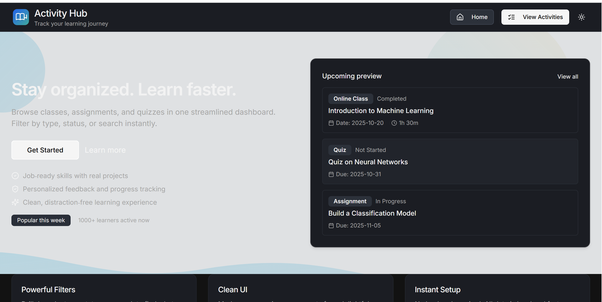

# Activity Hub - Web & Mobile App

A simple and fast activity listing app that helps learners find, start, and track their learning activities. Works on both web browsers and mobile phones (Android/iOS) from the same codebase.

##  What This App Does

- **View Activities**: See all your learning activities (classes, quizzes, assignments, discussions) in one place
- **Search & Filter**: Quickly find activities by searching or filtering by type and status
- **Activity Details**: Click any activity to see full details, progress, and resources
- **Light/Dark Mode**: Switch between light and dark themes for comfortable viewing
- **Responsive Design**: Works great on desktop, tablet, and mobile devices

## Screenshots

### Web App Screenshots

#### Home Page
<table>
<tr>
<td width="50%">

<p align="center"><small>Home page - Light Mode</small></p>
</td>
<td width="50%">

<p align="center"><small>Home page - Dark Mode</small></p>
</td>
</tr>
</table>

#### Activity Listing & Detail
<table>
<tr>
<td width="50%">

<p align="center"><small>Activity Listing Page</small></p>
</td>
<td width="50%">

<p align="center"><small>Activity Detail Page</small></p>
</td>
</tr>
</table>

#### Filters & Search
<table>
<tr>
<td width="33%">

<p align="center"><small>Filter - Type</small></p>
</td>
<td width="33%">

<p align="center"><small>Filter - Status</small></p>
</td>
<td width="33%">

<p align="center"><small>Search Functionality</small></p>
</td>
</tr>
</table>

#### Responsive Design
<table>
<tr>
<td width="50%">

<p align="center"><small>Responsive Design - Mobile View</small></p>
</td>
<td width="50%">

<p align="center"><small>Activity Card View</small></p>
</td>
<td width="50%">

<p align="center"><small>Web-Mobile Filter</small></p>
</td>
</tr>
<tr>
<td width="50%">

<p align="center"><small>Web-Mobile Filter 2</small></p>
</td>
<td width="50%">

<p align="center"><small>Web-Mobile Search</small></p>
</td>
</tr>
</table>


### Mobile App Screenshots

#### Home & Activity List
<table>
<tr>
<td width="50%">

<p align="center"><small>Home Page</small></p>
</td>
<td width="50%">

<p align="center"><small>Dark Mode</small></p>
</td>
</tr>
</table>

#### Activity Detail

<p align="center"><small>Activity Detail - Dark Mode</small></p>

#### Filters & Search
<table>
<tr>
<td width="33%">

<p align="center"><small>Filter Modal - Type</small></p>
</td>
<td width="33%">

<p align="center"><small>Filter Modal - Status</small></p>
</td>
<td width="33%">

<p align="center"><small>Search Modal</small></p>
</td>
</tr>
</table>

## Quick Start

### Prerequisites

Before you start, make sure you have:
- **Node.js** version 18 or higher 
- **npm** (comes with Node.js)
- For mobile: **Expo Go** app on your phone (for testing) OR Android Studio/Xcode (for building)

### Installation

1. **Clone or download this repository**
   ```bash
   git clone <your-repo-url>
   cd ActivityListings
   ```

2. **Install web app dependencies**
```bash
npm install
   ```

3. **Install mobile app dependencies**
   ```bash
cd mobile
npm install
   cd ..
   ```

## 💻 Running the Web App

1. **Start the development server**
```bash
   npm run dev
   ```

2. **Open your browser**
   - The app will open at `http://localhost:5173` (or the port shown in terminal)
   - You should see the Activity Hub homepage

3. **Navigate the app**
   - Click "View Activities" or go to `/activities` to see all activities
   - Use the search bar and filters to find specific activities
   - Click any activity card to see details
   - Click the moon/sun icon to toggle dark mode

## 📱 Running the Mobile App

### Option 1: Using Expo Go (Easiest - No Setup Required)

1. **Install Expo Go** on your phone
   - [Android: Google Play Store](https://play.google.com/store/apps/details?id=host.exp.exponent)
   - [iOS: App Store](https://apps.apple.com/app/expo-go/id982107779)

2. **Start the Expo server**
   ```bash
   cd mobile
   npm start
   ```

3. **Scan the QR code**
   - On Android: Open Expo Go app and scan the QR code
   - On iOS: Open Camera app, scan QR code, then open in Expo Go
   - The app will load on your phone!

### Option 2: Using Android Emulator

1. **Install Android Studio**
   - Download from [developer.android.com](https://developer.android.com/studio)
   - Install Android SDK and create a virtual device

2. **Start the emulator**
   ```bash
   cd mobile
   npm run android
   ```
   - This will automatically open the app in your Android emulator

### Option 3: Using iOS Simulator (Mac Only)

1. **Install Xcode** from the App Store

2. **Start the iOS simulator**
   ```bash
   cd mobile
   npm run ios
   ```
   - This will automatically open the app in the iOS simulator

## 🏗️ Building for Production

### Build Web App

```bash
npm run build
```

This creates optimized files in the `dist/public` folder that you can deploy to any web server.

### Build Mobile App (Android)

```bash
cd mobile
npm run android
```

This builds and installs the app on your connected Android device or emulator.

### Build Mobile App (iOS - Mac Only)

```bash
cd mobile
npm run ios
```

This builds and installs the app on your iOS simulator or connected device.

## Running Tests

We have basic tests to make sure everything works correctly.

### Run All Tests
```bash
npm test
```

### Run Tests in Watch Mode (Auto-rerun on changes)
```bash
npm test -- --watch
```

### Run Tests with UI Dashboard
```bash
npm run test:ui
```

### Check Test Coverage
```bash
npm run test:coverage
```

## Tech Choices & Why We Made Them

### Web App (React + Vite + Tailwind)

**Why React?**
- Most popular and well-supported framework
- Easy to find help and tutorials
- Great for building interactive user interfaces

**Why Vite?**
- Super fast development server (starts in milliseconds)
- Fast hot module replacement (changes appear instantly)
- Quick builds for production

**Why Tailwind CSS?**
- Write styles quickly without leaving your code
- Consistent design system
- Small file size (only used styles are included)

**Why Redux Toolkit?**
- Share the same state management between web and mobile
- Easy to test and debug
- Centralized data storage

### Mobile App (React Native + Expo)

**Why React Native?**
- Write once, run on both Android and iOS
- Uses native components (feels like a real app)
- Large community and lots of libraries

**Why Expo?**
- No need to install Android Studio or Xcode to start
- Easy testing with Expo Go app
- Built-in tools for building and deploying

### Shared Code

**Why share Redux slices and types?**
- Same filtering logic works on web and mobile
- No bugs from having different code in two places
- Easier to maintain and update

## Tradeoffs We Made

### 1. Separate UI Components (Web vs Mobile)

**What we did:** Web uses React components, mobile uses React Native components

**Why:** 
- Better performance (native components are faster)
- Better user experience (follows platform conventions)
- Can't reuse UI components between platforms

**Alternative considered:** React Native Web (one codebase)
- More complex setup
- Some features don't work well on web

### 2. Mock Data Instead of Real API

**What we did:** Use local mock data files

**Why:**
- Works immediately without backend setup
- Easy to test and develop
- No real data persistence

**Future:** Easy to replace with API calls using React Query

### 3. No Database

**What we did:** All data is in memory (lost on refresh)

**Why:**
- Simple to get started
- No database setup needed
- Data doesn't persist

**Future:** Can add database easily (we have Drizzle ORM ready)

## Known Limitations

1. **No Data Persistence**: Activities reset when you refresh the page. In a real app, this would connect to a backend API.

2. **Mock Data Only**: Currently shows sample activities. Need to connect to a real API for production.

3. **No Offline Support**: Mobile app needs internet to work (even though it uses local data now).

4. **Basic Filtering**: Filters work but could be enhanced with more options (date range, tags, etc.).

5. **No User Accounts**: Everyone sees the same activities. In production, you'd have user login and personal data.

## What Can Be Done Next

### Short Term (Easy Wins)

- **Add More Filters**: Filter by date range, difficulty level, instructor
- **Save Preferences**: Remember user's filter choices and theme preference
- **Keyboard Shortcuts**: Add keyboard shortcuts for power users (web)
- **Loading States**: Show loading spinners when fetching data
- **Error Messages**: Show friendly error messages if something goes wrong

### Medium Term (More Features)

- **Real API Integration**: Replace mock data with real backend API
- **Pagination**: Load activities in pages instead of all at once (better performance)
- **Search Improvements**: Search by description, tags, or instructor name
- **Activity Favorites**: Mark important activities as favorites
- **Recent Activities**: Show recently viewed activities at the top
- **Progress Tracking**: Better visualizations of learning progress

### Long Term (Big Features)

- **User Authentication**: Login system with user accounts
- **Offline Mode**: Cache activities and work without internet (mobile)
- **Push Notifications**: Reminders for due dates and upcoming classes
- **Comments & Notes**: Add personal notes to activities
- **Share Activities**: Share activity links with other learners
- **Analytics Dashboard**: See your learning stats and progress over time

## 🐛 Troubleshooting

### Web App Issues

**Problem:** App won't start
- **Solution:** Make sure Node.js 18+ is installed. Try deleting `node_modules` and running `npm install` again.

**Problem:** Port already in use
- **Solution:** Change the port in `vite.config.ts` or kill the process using port 5173.

**Problem:** Styles look broken
- **Solution:** Make sure Tailwind CSS is configured correctly. Try `npm run build` to check for errors.

### Mobile App Issues

**Problem:** Can't import shared files from `../client`
- **Solution:** Make sure `mobile/metro.config.js` is configured correctly. Restart Metro bundler: stop it (Ctrl+C) and run `npm start` again.

**Problem:** Expo Go can't connect
- **Solution:** Make sure your phone and computer are on the same Wi-Fi network. Try using the tunnel option: `npm start -- --tunnel`

**Problem:** Android emulator won't start
- **Solution:** Open Android Studio, go to AVD Manager, create a virtual device, then try again.

**Problem:** iOS build fails (Mac)
- **Solution:** Make sure Xcode is installed and you've run `xcode-select --install`. Open Xcode once to accept the license.

### Test Issues

**Problem:** Tests won't run
- **Solution:** Make sure all dependencies are installed: `npm install`. Check that `vitest.config.ts` exists in the root folder.

## 📸 Screenshots Included

All screenshots are located in the `docs/screenshots/` folder and displayed above. The screenshots showcase:

### Web App Features
- Home page in light and dark modes
- Activity listing page
- Activity detail page with full description
- Filter functionality (type and status)
- Search functionality
- Responsive design for mobile devices

### Mobile App Features
- Home page with activity list
- Dark mode support
- Activity detail view
- Filter modals (type and status selection)
- Search functionality
- Activity card views

All screenshots demonstrate the app's key features including light/dark mode support, filtering, searching, and responsive design across both web and mobile platforms.

## Project Structure

```
ActivityListings/
├── client/                    # Web app (React)
│   ├── src/
│   │   ├── components/       # React components
│   │   ├── pages/            # Page components
│   │   ├── store/            # Redux state (shared with mobile)
│   │   ├── types/            # TypeScript types (shared)
│   │   └── data/             # Mock data
│   └── index.html
│
├── mobile/                    # Mobile app (React Native)
│   ├── components/           # React Native components
│   ├── App.tsx
│   └── theme.ts              # Mobile theme
│
├── shared/                    # Shared code
│   └── types/                # Shared types
│
└── README.md                  # This file
```

## Code Examples

### Adding a New Activity Type

1. Update `client/src/types/activity.ts`:
```typescript
export type ActivityType = "Online Class" | "Quiz" | "Assignment" | "Discussion" | "Workshop";
```

2. Add filter option in `client/src/components/ActivityFilters.tsx`

3. Update mobile filter in `mobile/components/Filters.tsx`

### Adding a New Filter

1. Update the filter type in `client/src/store/slices/activitiesSlice.ts`
2. Add filter UI in `ActivityFilters.tsx`
3. Update the selector logic to handle the new filter

---
